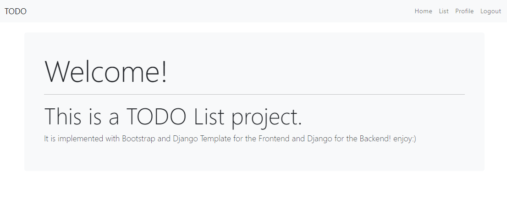

# Django-TODO-List

Todo list with:

- Backend and Authentication: **_Django_**
- Frontend: **_Bootstrap_** and **_Django Template_**

### Project Showcase

[](video/showcase.mp4)

### How to Locally Run the Project

Make sure to add the secret key to the `.env` file; you can generate a new one by heading to the path where the file `generate_secret_key.py` exists and run the following command.

- You may change the `.env.sample` file to `.env` file to test the project.

```
cd TODO_List/
python generate_secret_key.py
```

### Without Docker

Install virtual environment

```
pip install virtualenv
python -m venv env
```

Activate virtual environment.

```
cmd: env\scripts\activate
bash: source env/scripts/activate
```

Install dependencies

```
pip install -r Requirements.txt
```

Navigate to base directory and run migrations to form database

```
cd TODO_List/
python manage.py makemigrations
python manage.py migrate
```

Navigate to base directory and run server

```
cd TODO_List/
python manage.py runserver
```

### With Docker

In the root directory run the following

1. Build and run the container

```
docker build -t `CONTAINER NAME` .
docker-compose run -it `CONTAINER NAME`
```

- Since we are using docker-compose we will use

```
docker-compose build
docker-compose up
```

2. Run the container in the background without going into it

```
docker-compose up -d
```

3. Check all the containers that are currently running

```
docker-compose ps
```

4. Get into the running container

```
docker-compose exec -it `CONTAINER NAME` bash
```

5. Stop the running container

```
docker-compose down
docker-compose stop `CONTAINER NAME`
```

### Contributions

You may contribute to this project by creating pull request, make sure linting and CI passes. You may check for issues during linting by adding required files to `test-requirements.txt` and then running

```
pylint TODO_List/**/*.py
```

### License

This project is licensed under the MIT License - see the [LICENSE](LICENSE) file for details.
